<div align="center">

# 🌸 Hey, I'm Bhagyashri!


<br>


</div>

---

## 🌷 About Me

```python
class Bhagyashri:

    def __init__(self):
        self.name = "Bhagyashri"
        self.username = "Bhagyashri71"
        self.role = "AI/ML Enthusiast"

        self.languages = [
            "Python",
            "C++",
            "Java"
        ]

        self.interests = [
            "Artificial Intelligence",
            "Machine Learning",
            "Data Science",
            "Problem Solving",
            "Open Source"
        ]

    def currently_learning(self):
        return [
            "Machine Learning",
            "Deep Learning",
            "Data Analysis",
            "Python"
        ]

    def goal(self):
        return "Build intelligent solutions to real-world problems 🚀"
```
---

## 🛠️ Tech Stack

<div align="center">

### 💻 Programming Languages


<br><br>

### 🤖 AI / Machine Learning


<br><br>

### 🗄️ Databases & Tools


<br><br>

### 📊 Data Science


</div>

---

## 📊 GitHub Statistics

<div align="center">





</div>

---

## 🔥 GitHub Streak

<div align="center">


</div>

---

## 🏆 GitHub Achievements

<div align="center">



</div>

---

## 🐍 Contribution Snake

<br clear="both">
<div align="center">

</div>

---

## 🌱 Currently

<div align="center">

| 🧠 Learning | 🐍 Coding | 🤖 Exploring | 🚀 Building |
|:---:|:---:|:---:|:---:|
| Machine Learning | Python | Artificial Intelligence | Real-world Projects |

</div>

---

## 🌐 Connect With Me

<div align="center">

<a href="https://github.com/Bhagyashri71">

</a>

<a href="https://www.linkedin.com/">

</a>

</div>

---

<div align="center">

### ✨ "Learning today. Building tomorrow."

<br>


</div>
